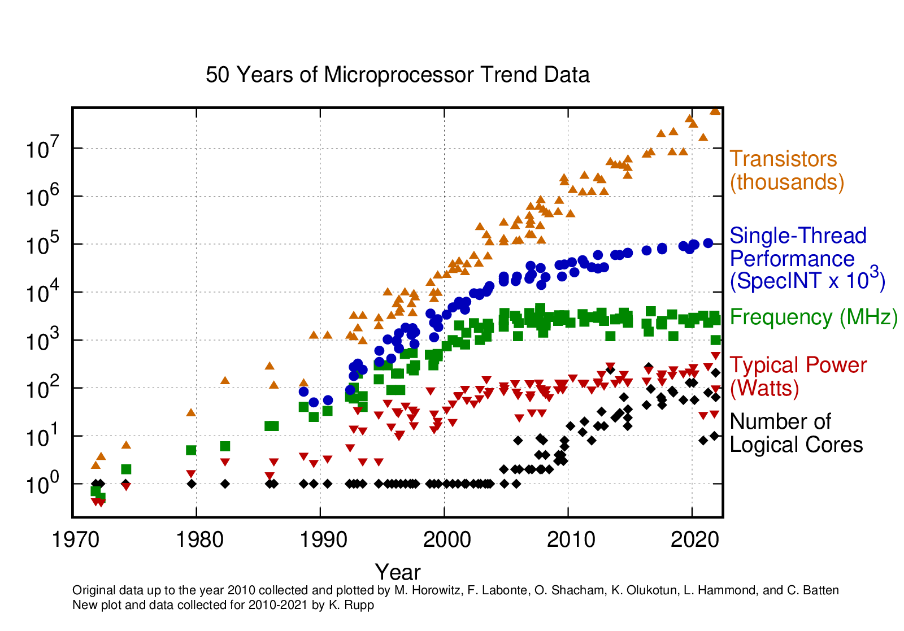
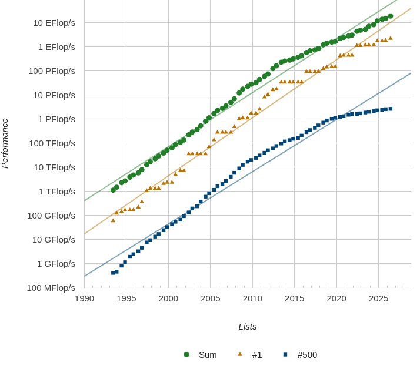

<!-- _class: lead -->
<!-- _paginate: false -->

# YZM 513 – High-Performance Programming for AI

### Week 1: Why Performance Matters; Profiling Python

**İstanbul Medeniyet Üniversitesi**
AI Engineering M.Sc. – Fall 2026

Assoc. Prof. Dr. Ammar Daşkın

---

## Before We Start – Quick Round-Table

- Name, background (CS? DS? Industry?)
- One thing you hope to get from this course

**Informal diagnostic** (show of hands, no grading):

- Used `threading` or `multiprocessing` in Python?
- Know what the GIL is?
- Ever called `model.cuda()` or used a GPU?
- Profiled code before?


---

## Course Roadmap

| Weeks | Theme |
|:-----:|-------|
| 1–2 | Python profiling, vectorisation, Numba JIT |
| 3 | Threading, multiprocessing, the GIL |
| 4 | Task parallelism: Dask / Ray |
| 5–8 | GPU architecture, CuPy, Numba CUDA, memory hierarchy |
| 9 | Data pipelines (`DataLoader`, `torch.profiler`) |
| 10–11 | Distributed training: DDP, FSDP, DeepSpeed |
| 12 | Mixed precision, quantisation |
| 13 | Inference optimisation (`torch.compile`, TensorRT) |
| 14–15 | Project presentations |

<!-- note:
everything stays in Python. No C/C++ required.
CUDA via Numba and CuPy. GPU labs run on Google Colab (free T4).
expect interactive format, not pure lecturing.
-->

---

## Assessment

| Component | Weight |
|-----------|:------:|
| Term Project (groups of ~3) | 30 % |
| Midterm (Vize) – Weeks 1–6 | 30 % |
| Final – Weeks 8–13 | 40 % |

- **Project:** profile an AI workload → apply ≥ 2 HPP techniques → benchmark report + live demo.
- Full details on the course GitHub.

---

<!-- _class: lead -->

# Part I
# What Is HPC and Why Should You Care?

---

## The Frequency Wall

- Transistor count kept growing (Moore's Law)
- **Clock frequency plateaued ~2005** at 3–5 GHz
- Reason: power dissipation / thermal limits


[github-karlrupp](https://github.com/karlrupp/microprocessor-trend-data)
**Consequence:** speedup now comes from **parallelism and specialisation**, not faster single cores.

<!-- note:
 "So if we can't make one core faster, what do we do?" → more cores, GPUs, accelerators.
-->

---

## What Is High-Performance Computing?

> Using **parallel hardware** and the **software techniques** to exploit it,
> in order to solve problems that are **too large or too slow**
> for a single processor.

- Multi-core CPUs, GPUs, clusters, supercomputers
- The *principles* apply at every scale
- Your laptop (8–16 cores) uses the same ideas as a 10 000-GPU cluster

<!-- note:
Key message:  don't need a supercomputer. The principles are scale-invariant.
-->

---


## What Is High-Performance Computing?

> Using **parallel hardware** and the **software techniques** to exploit it,
> in order to solve problems that are **too large or too slow**
> for a single processor.

But how do we *measure* "too slow"?

→ We count **floating-point operations per second (FLOPS)**.

<!-- note:
"Before we talk about parallelism, let's agree on the yardstick.
Everything in HPC is measured in FLOPS. "
-->

---

## Floating-Point Numbers – The Basics

Most HPC and AI workloads rely on floating-point arithmetic:

$$1.2 + 3.7, \qquad 2.8 \times 5.7, \qquad \text{matmul}(A, B)$$

Defined by the **IEEE 754** standard. Simplified model:

$$
x = (-1)^s \;\cdot\; 2^{\,e} \;\cdot\; \frac{m}{2^{\,p-1}}
$$

| Symbol | Meaning |
|:------:|---------|
| $s$ | sign bit (0 or 1) |
| $e$ | exponent ($e_{\min} \leq e \leq e_{\max}$) |
| $m$ | mantissa (integer, $2^{p-1} \leq m \leq 2^p - 1$) |
| $p$ | precision (number of significant bits) |

<!-- note:
Key point: base is always 2 on modern hardware.
The mantissa gives you the significant digits; the exponent scales the range.
don't need to memorise this— you need to understand WHY
single vs double vs half precision matter for AI.
-->

---

## Precision Levels

| Format | Bits | $p$ | Exponent range | Relative $\varepsilon$ | Digits |
|--------|:----:|:---:|:--------------:|:----------------------:|:------:|
| **FP64** (double) | 64 | 53 | $-1022$ to $1023$ | $2.2 \times 10^{-16}$ | ~16 |
| **FP32** (single) | 32 | 24 | $-126$ to $127$ | $1.2 \times 10^{-7}$ | ~8 |
| **FP16** (half) | 16 | 11 | $-14$ to $15$ | $9.8 \times 10^{-4}$ | ~3–4 |
| **BF16** (brain) | 16 | 8 | $-126$ to $127$ | $7.8 \times 10^{-3}$ | ~2–3 |

- $\varepsilon_{\text{rel}} = 2^{1-p}$: smallest value such that $1 + \varepsilon \neq 1$.
- **Why this matters for AI:** training in FP16/BF16 halves memory traffic
  and doubles throughput → **Week 12: Mixed Precision Training**.

<!-- note:
- FP32 is the default in PyTorch.
- FP16/BF16 gives 2x throughput on modern GPUs but you need loss scaling.
- BF16 keeps FP32's exponent range (avoids overflow) but sacrifices mantissa bits.
- This is WHY mixed precision training works and why H100's FP8 is a big deal.
-->

---

## Floating-Point Spacing (Intuition)

Numbers are **not** equally spaced:

```text
Between 1 and 2:  1,  1+2⁻²³,  1+2·2⁻²³,  ...  (FP32: ~8 million values)
Between 2 and 4:  2,  2+2⁻²²,  2+2·2⁻²²,  ...  (spacing doubles)
Between 4 and 8:  4,  4+2⁻²¹,  ...              (spacing doubles again)
```

> The higher the magnitude, the coarser the spacing.

**Consequence for AI:**
- Small gradients can underflow to zero in FP16.
- Large activations can overflow.
- Mixed-precision training uses FP32 accumulators to avoid this.

<!-- note:
The point is:
floating point is NOT real arithmetic. Rounding errors accumulate.
In AI, this manifests as training instability if you're not careful with precision.
GradScaler exists precisely because of this.
-->

---

## Measuring Performance: FLOP/s

**1 FLOP** = one floating-point operation (one `+` or `×`).

**1 FLOP/s** = one such operation per second.

| Prefix | Value | Name |
|:------:|------:|------|
| MFLOP/s | $10^6$ | Mega |
| GFLOP/s | $10^9$ | Giga |
| TFLOP/s | $10^{12}$ | Tera |
| PFLOP/s | $10^{15}$ | Peta |
| EFLOP/s | $10^{18}$ | Exa |

> A matrix multiply of two $n \times n$ matrices costs $\approx 2n^3$ FLOPs.

<!-- note:
The matmul formula is useful later: when they profile a transformer,
you can estimate theoretical FLOPs and compare against hardware peak.
Example: 4096×4096 matmul ≈ 2×(4096)³ ≈ 1.4×10¹¹ FLOPs ≈ 140 GFLOP.
On an RTX 4090 (73 TFLOP/s), that's ~2 µs theoretical.
-->

---

## How Many FLOP/s Do You Have?

| Device | Peak (GFLOP/s) | Notes |
|--------|---------------:|-------|
| Raspberry Pi 4 (ARM) | 24 | Low-power, cheap |
| Intel Xeon 8280M (28 cores) | 1 613 | Fast server CPU |
| PS5 GPU (RDNA 2) | 10 280 | Gaming GPU |
| Xbox Series X (RDNA 2) | 12 500 | Gaming GPU |
| **NVIDIA RTX 4090** | **73 000** | Consumer GPU |
| **NVIDIA A100 (FP32)** | **19 500** | Data-centre GPU |
| **NVIDIA H100 (FP8)** | **~2 000 000** | AI accelerator |

> A modern gaming GPU has ~50× the FLOPS of a 28-core server CPU.
> An H100 in FP8 has ~1000× the FLOPS of a Raspberry Pi.

<!-- note:
Key points:
- CPUs are good at FP64 and complex control flow.
- GPUs are optimised for FP32/FP16 throughput (many simple cores).
- AI accelerators (H100) push further with FP8 and tensor cores.
- The PS5/Xbox numbers are fun and relatable.
"If your laptop has an RTX 4060, you have ~15 TFLOPS. Why isn't
everyone training GPT-4 on their laptop?" → memory, interconnect, scale.
-->

---

## The TOP500 List

- Since 1993: biannual ranking of the world's fastest supercomputers.
- Metric: **LINPACK benchmark** (solving dense linear systems).
- Current #1 (2026): **Frontier** (ORNL) – ~1.2 EFLOP/s sustained.



**Performance over time** (log scale):
exponential growth, driven by parallelism.

🔗 [top500.org/statistics/perfdevel](https://top500.org/statistics/perfdevel/)

<!-- note:
- The line is roughly linear on log scale → exponential growth.
- Each "jump" corresponds to a new paradigm: vector → MPP → multi-core → GPU.
- Frontier crossing 1 EFLOP/s in 2022 was a milestone.
- The growth is NOT from faster clocks (we hit that wall). It's from MORE parallelism.

-->

---

## A Useful Definition of HPC

> 20 years ago, a PS5 would have been the world's fastest supercomputer.
> What we call "supercomputer" today is tomorrow's desktop.

So HPC isn't about the *size* of the machine.

> **High-Performance Computing is concerned with developing tools,
> algorithms, and applications that make optimal use of
> a given hardware environment.**

- Applies to a Raspberry Pi, your laptop, a 4-GPU workstation, or Frontier.
- The **principles** (parallelism, memory hierarchy, profiling) are scale-invariant.
- In this course: from your laptop's CPU → GPU → multi-GPU cluster.

<!-- note:
Message: "You don't need a supercomputer to do HPC. You need to understand
your hardware and write code that exploits it. That's what this course teaches."
This also addresses the elephant in the room: you may think
"I don't have an H100, so this doesn't apply to me." It does.
your laptop has 8+ cores and possibly a GPU. The principles are the same.
-->

---


## A small "feel the FLOPS" demo


```python
import time, numpy as np

n = 4096
A = np.random.rand(n, n).astype(np.float32)
B = np.random.rand(n, n).astype(np.float32)

t0 = time.perf_counter()
C = A @ B
t1 = time.perf_counter()

flops = 2 * n**3
print(f"Size: {n}×{n}")
print(f"Time: {t1-t0:.4f} s")
print(f"GFLOP/s: {flops / (t1-t0) / 1e9:.0f}")
```

---

<!-- note: 
On a typical laptop CPU this prints ~50–100 GFLOP/s. That's your laptop. The RTX 4090 does this 700× faster. The H100 in FP8, 20 000× faster. 

-->

---


## Amdahl's Law (1967)

$$S(N) = \frac{1}{(1 - P) + \dfrac{P}{N}}$$

- $P$ = parallelisable fraction of the program
- $N$ = number of processors

| $P$ | $N = 4$ | $N = 16$ | $N \to \infty$ |
|:---:|:-------:|:--------:|:--------------:|
| 0.90 | 2.1× | 3.9× | **10×** |
| 0.95 | 2.4× | 4.6× | **20×** |
| 0.99 | 3.1× | 6.2× | **100×** |

> The serial fraction is your **enemy**. Profile first.

<!-- note:
Key takeaway: if 5% of your code is serial, even infinite cores give you only 20x.
-->

---

## The Memory Wall

- CPU compute: ~100 GFLOPS
- Main-memory bandwidth: ~50 GB/s (DDR5)
- **Mismatch:** compute outgrew memory bandwidth by ~100×

| | Bandwidth |
|---|---|
| CPU DDR5 | ~50 GB/s |
| RTX 4090 (GDDR6X) | ~1 TB/s |
| A100 (HBM2e) | ~2 TB/s |
| H100 (HBM3) | ~3.35 TB/s |

Many AI ops are **memory-bound** (element-wise, reductions, attention KV-cache).
Adding FLOPS won't help if you're hitting the bandwidth ceiling.

<!-- note:
"Two ceilings: compute and memory. Your job is to figure out which one you're hitting."
We'll revisit in Week 9 (data pipelines) and Week 12 (mixed precision halves memory traffic).
-->

---

## Forms of Parallelism – Course Map

| Level | Example | This course |
|-------|---------|:-----------:|
| Instruction-level (SIMD) | AVX, NEON | implicit in NumPy |
| Thread-level (shared mem) | `threading`, `multiprocessing` | **Week 3** |
| Task / data parallel | Ray, Dask | **Week 4** |
| Accelerator (GPU) | CUDA, CuPy, Numba | **Weeks 5–8** |
| Distributed (multi-node) | DDP, DeepSpeed, MPI | **Weeks 10–11** |

> By December, you will have touched **every row**.


---

## HPC in AI: The Stakes

| Model | Year | Compute | Hardware |
|-------|:----:|---------|----------|
| GPT-3 (175 B) | 2020 | ~3 × 10²³ FLOPS | ~10 000 V100s |
| Llama-3 (405 B) | 2024 | ~10²⁵ FLOPS | 16 000 H100s |
| Frontier (HPC) | 2022 | 1.2 EFLOPS peak | 37 000+ GPUs |

- A single researcher fine-tuning a 7 B model on one A100
  still cares about **memory bandwidth, mixed precision, data-loading throughput**.

> **HPC is no longer just for national labs.
> Every ML engineer who trains or serves a model is doing applied HPC.**

<!-- note:
Numbers are approximate; cite the source you use.
The point is not to impress with big numbers but to say: "you need these skills even at small scale."
-->

---

<!-- _class: lead -->

# Part II
# AI Workloads: Where Does the Time Go?

---

## Anatomy of a Training Loop

```text
┌───────────────────────────────────────────────┐
│ 1. Load data (disk / network)        ← I/O    │
│ 2. Preprocess / augment (CPU)        ← CPU    │
│ 3. Transfer batch CPU → GPU          ← PCIe   │
│ 4. Forward pass (matmul, attention)  ← GPU    │
│ 5. Loss computation                  ← GPU    │
│ 6. Backward pass (gradients)         ← GPU    │
│ 7. Optimiser step                    ← GPU    │
│ 8. Gradient sync (if distributed)    ← Net    │
│                                               │
│ Repeat: N batches × M epochs                  │
└───────────────────────────────────────────────┘
```

**Any step can be the bottleneck. Profiling tells you which.**

<!-- note:
"Which of these do you think is most commonly the bottleneck
in practice?" Answer varies, but data loading (steps 1-2) and PCIe transfer (step 3)
surprise people. We fix those in Week 9.
-->

---

## Common Pathologies

| Symptom | Likely cause | Fix (course week) |
|---------|-------------|:-----------------:|
| GPU utilisation 30 % | Data loading too slow | Week 9 |
| PCIe transfer dominates | Batches too small | Week 9 |
| OOM on GPU | FP32 when FP16 suffices | Week 12 |
| Training takes weeks on 1 GPU | Not using DDP | Week 10 |
| Python loop takes minutes | Interpreter overhead | **Week 2** |

> You can't fix what you haven't measured. → **Profile.**

---

<!-- _class: lead -->

# Part III
# Why Is Python Slow?

---

## CPython Execution Model (10 000 ft)

```text
  your_script.py
       │
       ▼
  ┌─────────────┐
  │  Compiler   │ → bytecode (.pyc)
  └─────────────┘
       │
       ▼
  ┌─────────────────────────┐
  │  CPython Interpreter    │
  │  • dispatches bytecode  │
  │  • dynamic type checks  │
  │  • reference counting   │
  │  • GIL: one thread at a │
  │    time executes Python  │
  └─────────────────────────┘
       │
       ▼
  C / C++ / CUDA libraries (NumPy, BLAS, cuDNN)
```

<!-- note:
Key points:
1. Interpreted, not compiled to machine code.
2. Every `a + b` checks types, looks up __add__, allocates object, refcounts.
3. GIL serialises Python bytecode execution across threads.
4. The escape hatch: call into compiled C/CUDA libraries (NumPy, PyTorch).
-->

---

## The GIL in One Slide

- **Global Interpreter Lock**: one thread executes Python bytecode at a time.
- Protects CPython's reference-counting memory management.
- **Consequence:** `threading` ≠ CPU parallelism in Python.
- Threads still useful for **I/O-bound** work (network, disk).
- **Python 3.13+**: experimental free-threaded build (PEP 703).
  → We explore this properly in **Week 3**.
- **Python 3.14+** comes with free threaded(GIL free) option (PEP 779)

> For today: just know the constraint exists.


---

## The Escape Hatch: Vectorisation

```python
# Slow: 10⁶ iterations through the interpreter
def dot_python(a, b):
    s = 0.0
    for i in range(len(a)):
        s += a[i] * b[i]
    return s

# Fast: one call into compiled BLAS
import numpy as np
def dot_numpy(a, b):
    return np.dot(a, b)
```

> Full benchmark: `class-examples/week01/dot_comparison.py`

<!-- note:
On arrays of size 10^6, e.g. output:
Python loop:  0.2819 s
NumPy dot:    0.000053 s
Speedup:      5327×
"Why?" → loop in C, SIMD, cache-friendly access.
-->

---

## Live Demo Result

```text
Python loop:  0.2819 s
NumPy dot:    0.000053 s
Speedup:      5327×
```

- Python loop: type-check, multiply, add, store — **per element**, through interpreter.
- NumPy: one call → BLAS → SIMD, cache-line-friendly, no Python overhead.

> **This is why we vectorise. Week 2 is entirely about this.**

---

## So What Can We Do? (Semester Roadmap)

| Technique | Speedup source | Week |
|-----------|---------------|:----:|
| Vectorisation (NumPy) | Move loop into C / BLAS | 2 |
| JIT compilation (Numba) | Compile Python → machine code | 2 |
| Multiprocessing | Bypass GIL, use all cores | 3 |
| GPU (CuPy, Numba CUDA) | Thousands of parallel cores | 5–8 |
| Data-pipeline optimisation | Keep GPU fed | 9 |
| Mixed precision | Half memory, double throughput | 12 |
| Distributed training | Multiple GPUs / nodes | 10–11 |

> Today: **find** the bottleneck. Rest of semester: **fix** it.

---

<!-- _class: lead -->

# Part IV
# Profiling Tools – Live Demo

---

## The Profiling Workflow

```text
  Write code
     │
     ▼
  Profile  ──→  Identify bottleneck
     ▲               │
     │               ▼
  Re-profile  ←  Optimise
```

> "Premature optimisation is the root of all evil." — Knuth
>
> But *uninformed* optimisation is worse.
> **Profile first. Fix the top bottleneck. Re-profile.**

---

## Tool 1: `timeit` – Micro-Benchmarks

```python
import timeit

t = timeit.timeit(
    'np.dot(a, b)',
    setup='import numpy as np; a=np.random.rand(1000); b=np.random.rand(1000)',
    number=1000
)
print(f"avg: {t/1000*1e6:.1f} µs")
```

- Compares two implementations of a **small snippet**.
- Does **not** tell you where time goes in a large program.
- For that → `cProfile`.

---

## Tool 2: `cProfile` – Function-Level Profiling

```bash
python -m cProfile -s cumulative slow_script.py
```

> Full script: `class-examples/week01/slow_script.py`

**What you see:**

| ncalls | tottime | cumtime | filename:lineno(function) |
|-------:|--------:|--------:|---------------------------|
| 200 | ~1.8 | ~1.8 | slow_script.py:16(compute_distances) |
| 200 | ~0.2 | ~0.2 | slow_script.py:28(assign_clusters) |
| 5 | 0.050 | 0.050 | {built-in method time.sleep} |


<!-- note:
- compute_distances dominates (nested loop calling np.sqrt per element).
- assign_clusters is second (Python loop for argmin).
- time.sleep shows up (I/O simulation).
- np.sqrt and np.sum are called millions of times but each is fast;
  the overhead is the PYTHON LOOP calling them.
"The profiler tells you WHAT. Your job is WHY and HOW TO FIX."
-->

---

## Tool 3: `line_profiler` – Line-by-Line

```python
from line_profiler import profile

@profile
def compute_distances(points, centers):
    ...
```

```bash
kernprof -l -v slow_script.py
```

```text
Line #  Hits      Time  Per Hit  % Time  Line Contents
──────────────────────────────────────────────────────
     5  250000   182.3     0.7     6.2  for i in range(n):
     6  2000000  1401.2    0.7    47.5      diff = points[i] - centers[j]
     7  2000000  1204.8    0.6    40.9      dist[i,j] = np.sqrt(np.sum(diff**2))
```

→ Pinpoints the **exact line** inside the hot function.


---

## Tool 4: `py-spy` – Sampling Profiler

```bash
pip install py-spy

# Attach to a running script (no code changes!)
py-spy top -- python train.py

# Generate a flame graph
py-spy record -o profile.svg -- python train.py
```

- **No decorators, no code modification.**
- Great for long-running training scripts.
- PyTorch equivalent: `torch.profiler` → **Week 9**.

<!-- note:
Shows a flame graph image: x-axis = fraction of samples, y-axis = call stack depth.
Wide bars = time-consuming.  don't need to master this,
just know it exists.
-->

---

## Profiling Tools – Summary

| Tool | Granularity | When to use |
|------|-------------|-------------|
| `timeit` | Single snippet | Compare two implementations |
| `cProfile` | Function-level | First pass: where is the time? |
| `line_profiler` | Line-level | Drill into one hot function |
| `py-spy` | Sampling, no instrumentation | Long-running / production scripts |
| `torch.profiler` | Op-level (GPU + CPU) | PyTorch training loops (Week 9) |

---

<!-- _class: lead -->

# Part V
# Processes vs. Threads – First Concepts

---

## Process vs. Thread

```text
┌─────────────────────────────────────────────────┐
│  PROCESS  (own memory space, own PID)           │
│                                                 │
│  ┌──────────┐ ┌──────────┐ ┌──────────┐       │
│  │ Thread 1 │ │ Thread 2 │ │ Thread 3 │       │
│  │ stack    │ │ stack    │ │ stack    │       │
│  └──────────┘ └──────────┘ └──────────┘       │
│         shared: heap, file descriptors          │
└─────────────────────────────────────────────────┘
```

| | Process | Thread |
|---|---------|--------|
| Memory | Own address space | Shared with siblings |
| Creation cost | Heavy | Light |
| Communication | IPC (pipes, sockets) | Shared variables (+ locks!) |
| In Python | Bypasses GIL | Blocked by GIL (CPU-bound) |

<!-- note:
"We'll handle synchronisation properly in Week 3."
-->

---

## Why Parallelism Helps – Mental Model

- Task: process 8 000 images, each independent.
- 1 core → 10 min.  8 cores → **~1.25 min**. ✓
- Task: sequential simulation, step *t* depends on *t − 1*.
- 8 cores → still ~10 min. ✗

> **Amdahl's Law in practice:**
> the serial fraction limits you.
> Find it. Reduce it. Then parallelise the rest.

---

## Where This Connects to AI

| Parallelism type | AI example | Week |
|-----------------|------------|:----:|
| Multi-process data loading | `DataLoader(num_workers=8)` | 9 |
| Independent task parallelism | Hyperparameter sweep (Ray) | 4 |
| Data-parallel gradient sync | DDP: each GPU gets a shard | 10 |
| GPU-internal (SIMT) | Thousands of threads, one kernel | 5–8 |

> You'll implement every one of these.

---

<!-- _class: lead -->

# Part VI
# Hands-On Exercise

---

## Exercise: Profile a Slow Script

📁 **File:** `class-examples/week01/exercise_week1.py`

Three deliberately slow functions:
- `normalize_rows(matrix)` – nested loop for L2 normalisation
- `pairwise_distances(A, B)` – triple-nested loop
- `softmax(logits)` – Python loops for max, exp, divide

### Your task (20 min):

1. Run the script. Note total time.
2. Run `python -m cProfile -s cumulative exercise_week1.py`
3. Add `@profile` to `pairwise_distances`, run with `kernprof -l -v`
4. Write down:
   - Top 3 bottlenecks?
   - **Why** is each one slow?
   - Can you guess the fix? *(Don't implement yet.)*


---

## Exercise Debrief

**Expected findings:**

| Rank | Function | Why it's slow |
|:----:|----------|---------------|
| 1 | `pairwise_distances` | Triple loop; per-element Python arithmetic |
| 2 | `normalize_rows` | Double loop; repeated indexing overhead |
| 3 | `softmax` | Loop for max + loop for exp + loop for divide |

**Root cause (all three):** Python interpreter dispatching each `+`, `*`, `/` individually.

**The fix (next week):** vectorise with NumPy → 100–500× speedup. Then Numba JIT for what NumPy can't handle.

---

## Key Takeaways

1. AI workloads are enormous; hardware has parallelism you must **exploit deliberately**.
2. Python is slow for tight loops (interpreter, dynamic typing, GIL) but is the **glue** that calls fast C / CUDA libraries.
3. **Profile before you optimise.**
   `cProfile` → `line_profiler` → fix → re-profile.
4. Process ≠ thread. Shared memory needs care. More in Week 3.

---

## Next Week & Housekeeping

**Week 2:** NumPy vectorisation deep-dive + Numba `@jit` / `@njit`
→ We'll fix all three exercise functions and benchmark.

**Before next class:**
- ✅ Confirm environment: `python -c "import numpy; print(numpy.__version__)"`
- ✅ Install Numba: `pip install numba`
- 📖 Read: Numba "5-minute guide" (link on course site)

**Course GitHub:** [URL]
**Office hours:** by appointment / after class
**Questions?** → GitHub Issues tab

---

<!-- _class: lead -->
<!-- _paginate: false -->

# Thank You

### See you next week – bring your laptops.

*YZM 513 – İstanbul Medeniyet Üniversitesi – Fall 2026*


---

## Class-examples files

### `class-examples/week01/dot_comparison.py`

```python

```

### `class-examples/week01/slow_script.py`

```python

```

### `class-examples/week01/exercise_week1.py`

```python

```


